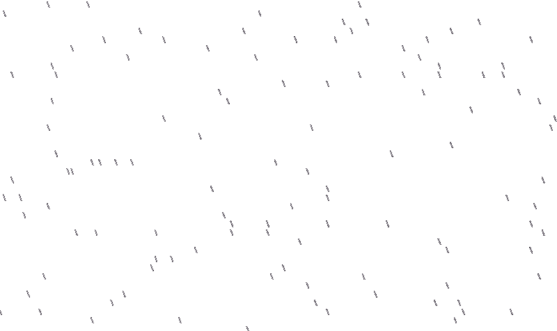

<table>
  <tr>
    <td width="50%" valign="top">
      <h1>Hello, I'm 0l3d.</h1>
      
 A simple programmer. 

      

        
        
        
      

      <pre><code class="language-bash">$ ffetch
   .---.    User:      0l3d  
 .'_:___".  OS:        Void Linux x86_64     
 |__ --==|  Kernel:    6.X (custom)     
 [  ]  :[|  Shell:     zsh    
 |__| I=[|  Editor:    vim/neovim     
 / / ____|  Language:  Code, Coffee, and Creativity.     
 |-/.____.  Seed:      0xBAADF00D
/___\ /___\ GCCParams: -O2 -g -Wall -Wextra -ffast-math
$ nasm -f elf64 rainas.asm -o rainas.o
$ gcc rainas.o -o rainas
$ ./rainas</code></pre>
      
    </td>
  </tr>
</table>
