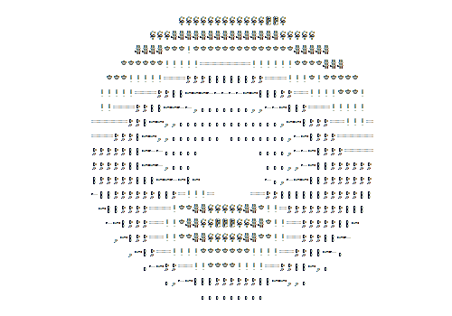

<table align="left">
<tr>
<td width="40%">

</td>
<td width="60%">
<h1>Hello, I'm 0l3d.</h1>

  
  
  
  

🦀 Rust and C lover, minimalist developer. 
💎 Go enthusiast, OOP skeptic. 
🔥 Linux boosts life energy.

</td>
</tr>
</table>

 

# My Projects
[**ffetch**](https://github.com/0l3d/ffetch) - Fast and minimal system info fetcher  
*→ Lightning-fast neofetch alternative* 🚀 **Active**

[**crshell**](https://github.com/0l3d/crshell) - Minimal dash-like shell written in Crust  
*→ POSIX-compliant, lightweight shell* ⚡ **Infrequent Updates**

[**fpass**](https://github.com/0l3d/fpass) - CLI password manager, minimal and fast  
*→ Secure password management from terminal* 🔒 **Active**

[**edfi**](https://github.com/0l3d/edfi) - TUI text editor, simple and fast  
*→ Fast and Simple vim-like editor* 📝 **Active**

[**sis**](https://github.com/0l3d/search-in-sight) - Fast fuzzy finder for terminal (TUI)  
*→ Blazing fast file/content search* 🔍 **Active**

[**matchr**](https://github.com/0l3d/matchr) - Lightweight fuzzy matcher library  
*→ Core matching algorithms for CLI tools* 📚 **Optimization Updates**

[**donut**](https://github.com/0l3d/donut) - Classic spinning donut animation in Crust  
*→ Mathematical art meets systems programming* 🍩 **Infrequent Updates**

[**brainsuck**](https://github.com/0l3d/brainsuck) - Minimalist Brainfuck interpreter with Crust  
*→ Esoteric language implementation* 🧠 **Infrequent Updates**

---

*All projects focus on performance, minimalism, and systems programming.*
