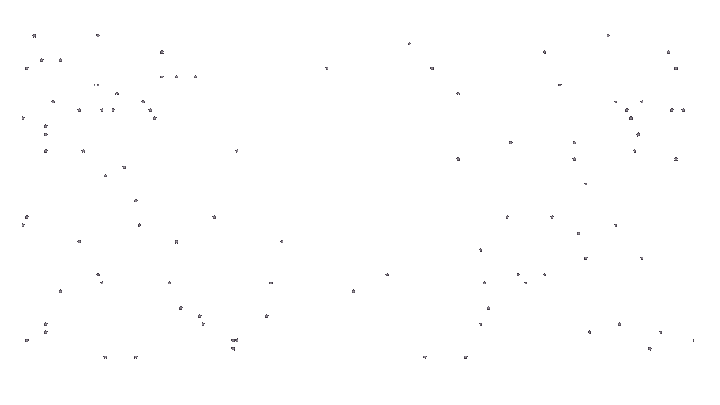

<table>
  <tr>
    <td width="50%" valign="top">
      
      <h1>Hello, I'm 0l3d.</h1>
      

        
        
        
        
        
      

      

        💙 C and Lua lover, minimalist developer. 
        💎 Go and Rust enthusiast, OOP skeptic. 
        🔥 Linux boosts life energy.
      

    </td>
    <td width="50%" valign="top">
      
      
      
    </td>
  </tr>
</table>
