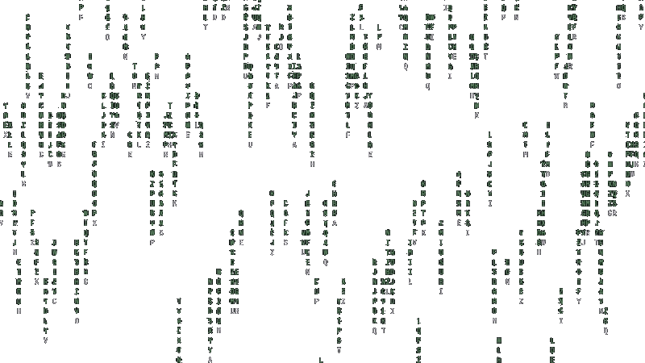

# Hello, I'm 0l3d.

A simple programmer.


[](https://www.buymeacoffee.com/oled)

```
$ ffetch
   .---.    User:      0l3d  
 .'_:___".  OS:        Void Linux x86_64     
 |__ --==|  Kernel:    6.X (custom)     
 [  ]  :[|  Shell:     zsh    
 |__| I=[|  Editor:    helix/(neo)vim
 / / ____|  Language:  Code, Coffee, and Creativity.     
 |-/.____.  Seed:      0xBAADF00D
/___\ /___\ GCCParams: -O2 -g -Wall -Wextra -ffast-math
$ cargo build --release
$ ./target/release/rmatrix
```

